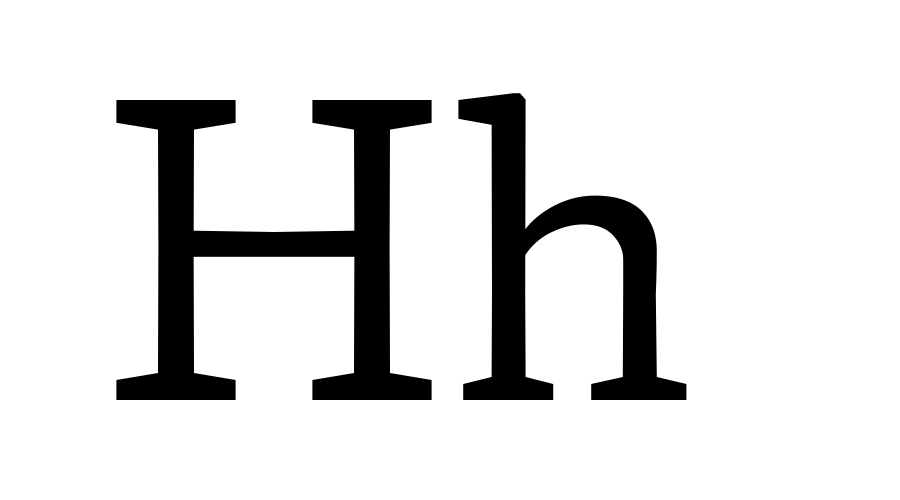

# Proposal Summary Form: Y Transparent Ascender

This proposal summary describes a proposed Y Transparent Ascender axis as part of a
proposed system of parametric and optical axes.

## Adminstrative Information

See details in [Type Network Parametric Axes Proposal Overview](Overview.md).

## General Technical Information

**Overview:** This describes a proposed X Transparent Ascender axis to vary the
height of ascenders.

**Related axes:** wght, width, opsz 

**Similar axes:** [ytuc](ProposalSummary_ytuc.md), [ytlc](ProposalSummary_ytlo.md), [ytde](ProposalSummary_trde.md).

**Axis type:** Parametric

## Proposed Axis Details

**Tag:** ytas

**Name:** Y Transparent Ascender 

**Description:** Assigns a “white” per mille value to each instance of the design space.

**Valid numeric range:**  0 to 1000

**Scale interpretation:** Values should be interpreted as per-mille-of-em. The ytas value is measured from the x-height to the top of the ascender.

**Recommended or required “Regular” value:** N/A

**Suggested programmatic interactions:** Example: Program or script may adjust the ascenders
in coordination leading and column width to prevent letters from touching vertically.

**UI recommendations:** Users may choose to program a variant in connection to direct or
conjunctive input for a page description language, or via a user interface.

**Script or language considerations:** Can be used for all scripts.

**Additional information:** Y Transparent Ascender changes the y, or vertical, ascenders.
Contributes to optical size in making type fit better when size is reduced. The zone or
general area that ascenders live in is an attribute that all users can easily point to
(along with collisions in this area suffered by fonts without it) but not an area they
may know by name. This name fits into the systematic structure of the overall system of
proposed axes: Y dimension transparency of ascenders.

## Justification

See details in [Type Network Parametric Axes Proposal Overview](Overview.md).

## Other Supporting Information

The following image provides a visual demonstration:

